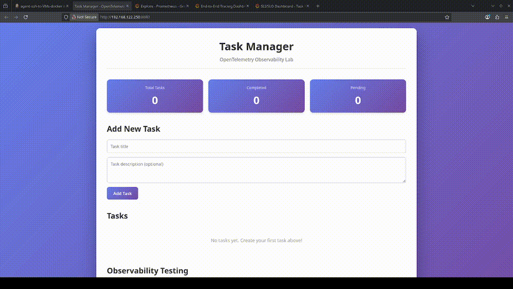
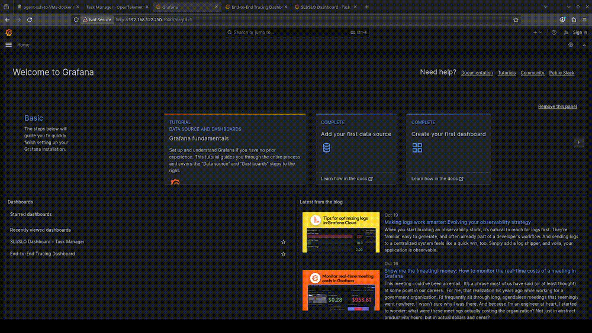
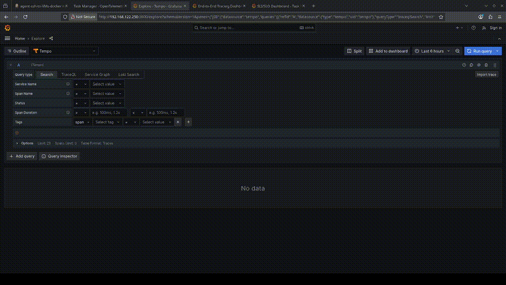
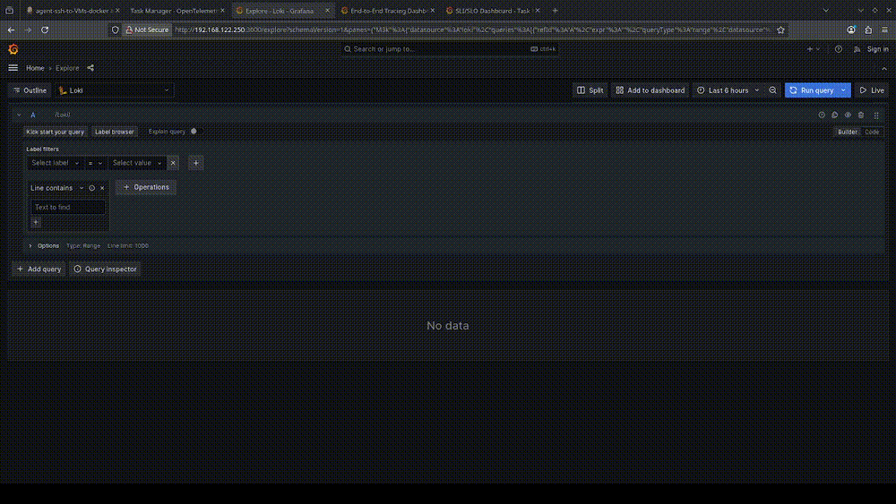

## 🚀 Milestone 1 — Wrap-Up _(Oct 20, 2025)_

> **TL;DR** — A production-inspired observability lab: **Flask backend**, **browser-instrumented frontend**, **Nginx** reverse proxy, and a full **OTel → Collector → Tempo/Loki** pipeline with **Prometheus** metrics. It’s resilient to container/IP churn, exposes clear **SLIs**, and ships **end-to-end traces** with **correlated logs**.

---

### ⭐ Highlights

- **Three Pillars, Clean Separation**
  Traces (**OTel → Tempo**), Logs (**JSON → Loki**), Metrics (**Hybrid: Prometheus for HTTP, OTel for DB**).
- **Reverse Proxy Resilience**  
  Nginx dynamic DNS + variable `proxy_pass` fixed the 502/DNS race on container restart.
- **End-to-End Tracing**  
  Browser → Flask → DB spans with `trace_id`/`span_id` log correlation.
- **SLI/SLO Dashboards**  
  Availability, error rate, P95 latency, request rate, DB timings in Grafana.
- **Repeatable Ops**  
  Deployment Verification checklist ensures scrape targets, traces, and dashboards are actually live.

---

### 🔧 Key Decisions & Fixes (at a glance)

| Area | Decision | Why | Outcome |
|---|---|---|---|
| **Metrics** | Hybrid (Prometheus + OTel) | Prometheus for HTTP metrics, OTel for DB metrics | Complementary instrumentation |
| **API Pathing** | Keep `/api` prefix via Nginx → Flask | Transparent routing, simpler config | Fewer edge-cases & rewrites |
| **Proxy Resilience** | Dynamic DNS + `$upstream` `proxy_pass` | Backends get new IPs on restart | No more 502s on container churn |
| **Security** | SSH key-only auth + locked password | Production-grade baseline | Safer CI/CD deploy path |
| **Delivery** | Jenkins controller + Docker agent; SSH + `rsync` | Match bind-mount paths on target | Reliable, environment-aware deploys |

---

### 📊 What I Can Prove Works

- **Traces** show Browser → Flask → DB with parent/child spans.
- **Logs** include `trace_id`/`span_id` and correlate to traces.
- **Metrics** power **SLI/SLO** panels (availability, P95 latency).
- **Grafana** dashboards render live with traffic.
- **Nginx** survives container restarts without 502s.

> _Tip:_ Generate traffic, then open **Grafana → SLI/SLO Dashboard** to watch metrics, traces, and logs populate.

---

### 🛣️ What’s Next
- **Phase 2** → OPA/Rego policies, SAST/DAST, HCP Vault, artifact management.  
- **Phase 3** → Kubernetes (Helm, StatefulSets), PostgreSQL, Istio + Envoy service mesh.

> **Verification:** Run the **Deployment Verification** checklist after any change to confirm green scrapes, traces, and dashboards.


# Production-Grade Observability: From On-Premises to Cloud

## A Proof of Concept for Real-World SRE Practice

[](https://opensource.org/licenses/MIT)
[](https://www.docker.com/)
[](https://opentelemetry.io/)
[](https://grafana.com/)
[](https://prometheus.io/)

---

## 📖 Table of Contents

- [Overview](#overview)
- [What Makes This Different](#what-makes-this-different)
- [Quick Start](#quick-start)
- [Documentation](#documentation)
- [Architecture](#architecture)
- [Technology Stack](#technology-stack)
- [Learning Outcomes](#learning-outcomes)
- [Roadmap](#roadmap)
- [Contributing](#contributing)

---

## Overview

This project is a **production-grade observability stack** built on simulated on-premises infrastructure. It demonstrates end-to-end distributed tracing, metrics collection, and log aggregation using industry-standard tools.

**But it's more than that.**

This is **milestone 1** of the **On-Prem Domain**—a comprehensive learning path that builds infrastructure expertise from bare metal to hybrid cloud. Every component was built through trial, error, and iteration, with all failures documented for learning.

### The Three Pillars of Observability

```
┌──────────────────────────────────────────────────────────────┐
│  TRACES (OpenTelemetry)                                      │
│  • Browser → Backend → Database correlation                  │
│  • Parent-child span relationships                           │
│  • W3C Trace Context propagation                             │
│  • Export: OTLP → Tempo                                      │
└──────────────────────────────────────────────────────────────┘

┌──────────────────────────────────────────────────────────────┐
│  METRICS (Prometheus)                                        │
│  • Request rates, error rates, latency percentiles           │
│  • SLI/SLO dashboards (availability, P95 latency)            │
│  • Database query performance tracking                       │
│  • Export: /metrics → Prometheus scrape                      │
└──────────────────────────────────────────────────────────────┘

┌──────────────────────────────────────────────────────────────┐
│  LOGS (Loki via OpenTelemetry)                               │
│  • Structured JSON logging                                   │
│  • Automatic trace_id/span_id injection                      │
│  • Log-to-trace correlation                                  │
│  • Export: OTLP → Loki                                       │
└──────────────────────────────────────────────────────────────┘
```

### Application Stack

- **Frontend:** Nginx reverse proxy serving static HTML/JS
- **Backend:** Flask (Python 3.11) with full OpenTelemetry instrumentation
- **Database:** SQLite (migrating to PostgreSQL in Phase 3)
- **Observability:** OpenTelemetry Collector, Tempo, Prometheus, Loki, Grafana

---

## 🎥 Visual Walkthrough

### Application & Dashboards

<div align="center">

**Frontend Application & SLI/SLO Dashboard**

*Real-time metrics tracking service availability, P95 latency, error rates, and request volume*



---

**End-to-End Distributed Tracing Dashboard**

*Visualizing request flows across browser → backend → database with parent-child span relationships*


</div>

### Observability Stack in Action

<div align="center">

**Prometheus Metrics Exploration**

*Querying service metrics with PromQL - request rates, error percentiles, and latency histograms*



---

**Tempo Trace Analysis**

*Deep-dive into distributed traces using TraceQL - finding slow requests and error patterns*



---

**Loki Log Aggregation**

*Searching structured logs with LogQL - trace correlation and log-to-trace navigation*



</div>

---

## What Makes This Different

### 🏗️ Built on Simulated On-Premises Infrastructure

Not cloud. Not managed services. **Bare metal virtualization** using KVM/QEMU/libvirt on Debian 13.

**Why?**
- Understand infrastructure from the ground up
- Learn what cloud abstractions hide (networking, storage, orchestration)
- Zero recurring costs (one-time hardware investment)
- Directly applicable to enterprise on-prem environments

### 🔄 Deployed via CI/CD Pipeline

Automated deployment through **containerized Jenkins** with Docker agents and SSH-based deployment. Secrets are managed manually in this iteration; prior builds used HashiCorp Vault and that integration returns in a later phase.

**Pipeline Features:**
- Git-based source control
- Automated builds with Docker Buildkit
- Remote deployment via SSH + rsync
- **Key-only SSH authentication** (ED25519, production-grade security)
- Health check validation
- Smoke tests

**Security First:**
- Password authentication disabled on all VMs
- Industry best practice implementation
- Future hardening planned: fail2ban, UFW firewall, 2FA

See: [docs/phase-1-docker-compose/architecture/cicd-pipeline.md - CI/CD Pipeline Architecture](docs/phase-1-docker-compose/architecture/cicd-pipeline.md)

### 📊 Production-Ready Observability

This stack implements:
- **SLI/SLO tracking** (service availability >99%, P95 latency <500ms)
- **Distributed tracing** across all tiers (browser → backend → database)
- **Trace-log correlation** (click trace_id in logs → jump to full trace)
- **Pre-built Grafana dashboards** (SLI/SLO, end-to-end tracing)

### 📚 Comprehensive Documentation

Over **100,000 words** of documentation covering:
- **ARCHITECTURE.md:** Complete system design from hypervisor to application (47,000+ words) — `docs/phase-1-docker-compose/ARCHITECTURE.md`
- **DESIGN-DECISIONS.md:** All architectural choices, trade-offs, and rationale — `docs/phase-1-docker-compose/DESIGN-DECISIONS.md`
- **JOURNEY.md:** The story of building this (struggles, breakthroughs, lessons) — `docs/phase-1-docker-compose/JOURNEY.md`
- **IMPLEMENTATION-GUIDE.md:** Technical deep-dive with troubleshooting — `docs/phase-1-docker-compose/IMPLEMENTATION-GUIDE.md`
- **Verification Guide:** Deployment verification and CI/CD testing — `docs/phase-1-docker-compose/VERIFICATION-GUIDE.md`
- **Configuration Reference:** Complete YAML configuration guide — `docs/phase-1-docker-compose/CONFIGURATION-REFERENCE.md`

### 🧪 Battle-Tested

Every error message was encountered, debugged, and documented:
- "Working outside of application context" (Flask lifecycle)
- "502 Bad Gateway" (Nginx DNS caching)
- "Database not found" (container filesystems)
- "Metric duplication" (OTel SDK vs. Prometheus client)

See: [JOURNEY.md](docs/phase-1-docker-compose/JOURNEY.md) for the complete story.

---

## Quick Start

### Prerequisites

- **Docker Engine** 20.10+ and **Docker Compose** 2.0+
- **4GB+ RAM** available
- **Ports available:** 3000, 3100, 3200, 4317, 4318, 5000, 8080, 9090

### Deployment Options

Choose the deployment method that fits your learning goals:

---

#### Option 1: Startup Script (Recommended - Aligned with Jenkins Pipeline)

**Why this option?** Follows the same deployment pattern as the production Jenkins pipeline, using project naming for better container organization.

```bash
# Clone repository
git clone https://github.com/Walid-Ahmed-Dev/Opentelemetry_Observability_Lab.git
cd Opentelemetry_Observability_Lab

# Run startup script
chmod +x start-lab.sh
./start-lab.sh
```

**What it does:**
- Defaults `PROJECT="lab"` for organized container naming (matches Jenkins pipeline) while honoring any `PROJECT` value you export before running the script
- Defaults `LAB_HOST="localhost"` for printed URLs; override with `LAB_HOST=<vm-ip>` when deploying remotely
- Runs: `docker compose -p lab up -d --build`
- Validates all service health checks
- Provides clear status output

**Managing containers with project name:**

```bash
# View logs
docker compose -p lab logs -f backend

# Stop all services
docker compose -p lab down

# Restart a specific service
docker compose -p lab restart backend

# Check status
docker compose -p lab ps
```

**Design Decision:** Using `-p lab` creates a namespace for all containers (e.g., `lab-backend-1`, `lab-frontend-1`), preventing naming conflicts with other Docker Compose projects and matching the production pipeline pattern. See [DESIGN-DECISIONS.md](docs/phase-1-docker-compose/DESIGN-DECISIONS.md) for full rationale.

---

#### Option 2: Manual Docker Compose with Project Name (Same Standard as Pipeline)

If you prefer manual control but want to follow the same standard:

```bash
# Clone repository
git clone https://github.com/Walid-Ahmed-Dev/Opentelemetry_Observability_Lab.git
cd Opentelemetry_Observability_Lab

# Start with project name (matches Jenkins pipeline and startup script)
export DOCKER_BUILDKIT=1
docker compose -p lab up -d --build

# Check status
docker compose -p lab ps

# View logs
docker compose -p lab logs -f
```

**Note:** You **must** include `-p lab` in all subsequent commands (logs, down, restart) for proper container management.

---

#### Option 3: Simple Docker Compose (No Project Name)

If you prefer the simplest approach without project naming:

```bash
# Clone repository
git clone https://github.com/Walid-Ahmed-Dev/Opentelemetry_Observability_Lab.git
cd Opentelemetry_Observability_Lab

# Start all services (uses directory name as project)
docker compose up -d

# Check status
docker compose ps
```

**Trade-off:** Container names will use the directory name as prefix (e.g., `opentelemetry_observability_lab-backend-1`). This works fine but doesn't match the standardized pipeline pattern.

---

#### Option 4: Jenkins Pipeline Deployment (Full CI/CD Experience)

**For the complete production deployment experience:**

**Prerequisites:**
- Custom Jenkins agent with required tools (see [jenkins-inbound-agent-with-jq-docker-rsync](jenkins/jenkins-inbound-agent-with-jq-docker-rsync))
- Jenkins controller and agent running (see [jenkins_setup](jenkins/jenkins_setup))
- Required plugins installed (see [jenkins_plugins.md](jenkins/jenkins_plugins.md))
  - SSH Agent Plugin (required)
  - Docker Pipeline (required)
  - Docker Plugin (required)

**Setup Steps:**
1. Build custom Jenkins agent image (Dockerfile in `jenkins/` directory)
2. Deploy Jenkins controller + agent (run `jenkins/jenkins_setup` script)
3. Install required plugins via Jenkins UI
4. Configure VM target (SSH keys, Docker daemon)
5. Create pipeline job pointing to project repository
6. Run pipeline: Checkout → Sync → Deploy → Smoke Tests

**Complete Guide:** [docs/phase-1-docker-compose/architecture/cicd-pipeline.md - CI/CD Pipeline Architecture](docs/phase-1-docker-compose/architecture/cicd-pipeline.md)

**Pipeline deploys using:**
```bash
ssh ${VM_USER}@${VM_IP} "
  cd ${VM_DIR} && \
  PROJECT=lab LAB_HOST=${VM_IP} ./start-lab.sh   # Override as needed (e.g., PROJECT=staging LAB_HOST=<other-host>)
"
```

---

### Verify Deployment

**Important:** If you're running on a remote VM, set `LAB_HOST=<VM_IP>` when invoking `start-lab.sh` (the Jenkins pipeline example already does this) or manually replace `localhost` with the VM's IP in the URLs below.

**Application:**
- Frontend: `http://<VM_IP>:8080` (or `http://localhost:8080` for local)
- Backend API: `http://<VM_IP>:5000/api/tasks`

**Observability Stack:**
- Grafana: `http://<VM_IP>:3000` (anonymous login enabled)
- Prometheus: `http://<VM_IP>:9090`
- Tempo: `http://<VM_IP>:3200/ready`
- Loki: `http://<VM_IP>:3100/ready`

**Generate Traffic:**
1. Open `http://<VM_IP>:8080` (use your VM's IP or `localhost`)
2. Create a few tasks (click "Add Task")
3. Navigate to Grafana → Dashboards → "SLI/SLO Dashboard - Task Manager"
4. See metrics, traces, and logs populate

**Detailed Verification Guide:** [phase-1-docker-compose/VERIFICATION-GUIDE.md](docs/phase-1-docker-compose/VERIFICATION-GUIDE.md)

---

## Documentation

📚 **[Complete Documentation Index](docs/README.md)** - Master index for all phases and cross-cutting docs

### Phase 1: Docker Compose Foundation ✅

**Current phase documentation:**

| Document | Purpose | Size |
|----------|---------|------|
| **[Architecture](docs/phase-1-docker-compose/ARCHITECTURE.md)** | Complete system architecture from infrastructure to application | 47,000 words |
| **[Design Decisions](docs/phase-1-docker-compose/DESIGN-DECISIONS.md)** | All architectural decisions with trade-offs and rationale | 15,000 words |
| **[Journey](docs/phase-1-docker-compose/JOURNEY.md)** | The story of building this (failures, breakthroughs, lessons) | 12,000 words |
| **[Implementation Guide](docs/phase-1-docker-compose/IMPLEMENTATION-GUIDE.md)** | Architecture, integration patterns, and lessons learned | 18,000 words |
| **[Configuration Reference](docs/phase-1-docker-compose/CONFIGURATION-REFERENCE.md)** | Complete YAML configuration guide for all components | 25,000 words |
| **[Verification Guide](docs/phase-1-docker-compose/VERIFICATION-GUIDE.md)** | Deployment verification and CI/CD testing procedures | 28,000 words |
| **[Troubleshooting](docs/phase-1-docker-compose/troubleshooting/)** | Operational playbooks for common issues | 12,000 words |
| **[Code Snippets](docs/phase-1-docker-compose/snippets/)** | Reusable configuration examples | Reference library |

Troubleshooting quick links: [Common Issues](docs/phase-1-docker-compose/troubleshooting/common-issues.md), [Metrics Dropdown Issue](docs/phase-1-docker-compose/troubleshooting/metrics-dropdown-issue.md), [Trace Search Guide](docs/phase-1-docker-compose/troubleshooting/trace-search-guide.md)

### Cross-Cutting Knowledge

| Document | Purpose | Size |
|----------|---------|------|
| **[Observability Fundamentals](docs/cross-cutting/observability-fundamentals.md)** | Three Pillars, SLI/SLO, OpenTelemetry basics | 15,000 words |
| **[TraceQL Reference](docs/cross-cutting/traceql-reference.md)** | Query language guide for Tempo | 4,000 words |
| **[PromQL Reference](docs/cross-cutting/promql-reference.md)** | Prometheus query language guide | 8,000 words |
| **[LogQL Reference](docs/cross-cutting/logql-reference.md)** | Loki query language guide | 7,000 words |

**Total:** 180,000+ words across all documentation

### Quick References

**Common Commands:**
```bash
# View logs
docker compose logs -f backend
docker compose logs -f otel-collector

# Restart specific service
docker compose restart backend

# Check service health
curl http://localhost:13133  # OTEL Collector healthcheck
curl http://localhost:5000/health  # Backend health

# Tear down stack
docker compose down

# Tear down with volume cleanup (fresh start)
docker compose down -v
```

**Grafana Dashboards:**
- **SLI/SLO Dashboard:** Service availability, P95 latency, error rates, DB performance
- **End-to-End Tracing:** Distributed trace visualization, service dependency maps

**Prometheus Queries (SLIs):**
```promql
# Service Availability
100 * (1 - (sum(rate(http_errors_total[5m])) / sum(rate(http_requests_total[5m]))))

# P95 Response Time
histogram_quantile(0.95, sum(rate(http_request_duration_seconds_bucket[5m])) by (le))

# Database P95 Latency
histogram_quantile(0.95, sum(rate(db_query_duration_seconds_bucket[5m])) by (le, operation))
```

**Loki Log Queries:**
```logql
# All logs from backend
{service_name="flask-backend"}

# Filter by log level
{service_name="flask-backend", level="ERROR"}

# Search for specific trace
{service_name="flask-backend"} | json | trace_id="a1b2c3d4e5f6789..."
```

**Tempo Trace Queries (TraceQL):**
```traceql
# Find slow requests (>500ms)
{duration > 500ms}

# Find errors in specific endpoint
{span.http.route = "/api/tasks" && status = error}

# Find slow database queries
{span.db.query.duration > 50ms}
```

---

## Architecture

### High-Level Overview

```
┌─────────────────────────────────────────────────────────────────┐
│                   PHYSICAL HOST (Debian 13)                     │
│  ┌───────────────────────────────────────────────────────────┐  │
│  │        KVM/QEMU/Libvirt Hypervisor                        │  │
│  │  ┌─────────────────────────────────────────────────────┐  │  │
│  │  │  VM: 192.168.122.250 (Application)                  │  │  │
│  │  │  • Docker Engine                                    │  │  │
│  │  │  • Observability Stack (7 containers)               │  │  │
│  │  └─────────────────────────────────────────────────────┘  │  │
│  └───────────────────────────────────────────────────────────┘  │
│  ┌───────────────────────────────────────────────────────────┐  │
│  │   Jenkins & CI Services (bare metal on host)              │  │
│  │   • Jenkins Controller                                    │  │
│  │   • Docker Agents                                         │  │
│  │   • HashiCorp Vault (returning in later phases)           │  │
│  └───────────────────────────────────────────────────────────┘  │
└─────────────────────────────────────────────────────────────────┘
```

### Container Architecture (Application VM)

```
┌─────────────────────────────────────────────────────────────────┐
│  Docker Network: otel-network (bridge)                          │
│                                                                 │
│  ┌──────────────┐      ┌──────────────┐      ┌──────────────┐   │
│  │  Frontend    │      │  Backend     │      │  OTel        │   │
│  │  (Nginx)     │─────▶│  (Flask)     │─────▶│  Collector   │   │
│  │  Port: 8080  │      │  Port: 5000  │      │  Port: 4318  │   │
│  └──────────────┘      └──────┬───────┘      └──────┬───────┘   │
│                               │                     │           │
│                               ▼                     ▼           │
│                        ┌──────────────┐      ┌──────────────┐   │
│                        │  SQLite      │      │  Tempo       │   │
│                        │  Database    │      │  (Traces)    │   │
│                        └──────────────┘      │  Prometheus  │   │
│                                              │  (Metrics)   │   │
│                                              │  Loki (Logs) │   │
│                                              └──────┬───────┘   │
│                                                     │           │
│                                                     ▼           │
│                                              ┌──────────────┐   │
│                                              │  Grafana     │   │
│                                              │  Port: 3000  │   │
│                                              └──────────────┘   │
└─────────────────────────────────────────────────────────────────┘
```

**Key Design Decisions:**

1. **Nginx Reverse Proxy + CORS Headers** (defense-in-depth) for `/api/*` routing
   - Same-origin requests eliminate preflight overhead
   - Redundant CORS configuration for fallback scenarios
   - Production-standard architecture with safety nets
   - See: [DESIGN-DECISIONS.md - DD-003](docs/phase-1-docker-compose/DESIGN-DECISIONS.md#dd-003-frontend-backend-communication-nginx-proxy-vs-cors-headers)

2. **Dynamic DNS Resolution** in Nginx (not static hostname)
   - Handles backend container restarts gracefully
   - No 502 errors on IP changes
   - See: [DESIGN-DECISIONS.md - DD-007](docs/phase-1-docker-compose/DESIGN-DECISIONS.md#dd-007-nginx-dns-resolution-static-vs-dynamic)

3. **Hybrid Metrics Strategy** (Prometheus + OTel)
   - Prometheus Client for HTTP/SLI metrics (request rates, errors, latency)
   - OpenTelemetry SDK for database metrics (query duration, operation types)
   - Complementary approaches for different metric types
   - See: [DESIGN-DECISIONS.md - DD-006](docs/phase-1-docker-compose/DESIGN-DECISIONS.md#dd-006-metric-instrumentation-prometheus-client-vs-otel-sdk-metrics)

**Full Architecture Docs:** [ARCHITECTURE.md](docs/phase-1-docker-compose/ARCHITECTURE.md)

---

## Technology Stack

### Infrastructure Layer

| Component | Version | Purpose |
|-----------|---------|---------|
| **KVM/QEMU** | Native (kernel 6.12) | Hypervisor (hardware virtualization) |
| **libvirt** | Latest | VM lifecycle management, virtual networking |
| **Debian** | 13 (Trixie) | Host and guest OS |

### Application Layer

| Component | Version | Purpose |
|-----------|---------|---------|
| **Python** | 3.11 | Backend runtime |
| **Flask** | 3.0.0 | Web framework |
| **SQLAlchemy** | 3.1.1 | ORM (migrating to PostgreSQL in Phase 3) |
| **Nginx** | Alpine (latest) | Reverse proxy, static file server |

### Observability Layer

| Component | Version | Purpose |
|-----------|---------|---------|
| **OpenTelemetry Collector** | 0.96.0 (contrib) | Telemetry pipeline hub |
| **OpenTelemetry Python SDK** | 1.22.0 | Auto-instrumentation (Flask, SQLAlchemy) |
| **Grafana Tempo** | 2.3.1 | Distributed trace storage (TraceQL) |
| **Prometheus** | 2.48.1 | Metrics storage (TSDB), PromQL queries |
| **Grafana Loki** | 2.9.3 | Log aggregation, LogQL queries |
| **Grafana** | 10.2.3 | Unified visualization, dashboards |
| **prometheus_client** | Latest | Python metrics library (Counters, Histograms) |

### CI/CD Layer

| Component | Version | Purpose |
|-----------|---------|---------|
| **Jenkins** | LTS (JDK 17) | CI/CD controller |
| **Docker** | 20.10+ | Containerization |
| **Docker Compose** | 2.0+ | Multi-container orchestration |
| **HashiCorp Vault** | Latest | Previously integrated; returns in future phase |
| **rsync** | 3.2.7 | File synchronization to VMs |

---

## Learning Outcomes

### What You'll Understand After This Project

**Infrastructure:**
- ✅ Hypervisor concepts (KVM, QEMU, hardware virtualization)
- ✅ Virtual networking (libvirt bridges, NAT, DNS/DHCP)
- ✅ Storage pools and virtual volumes (qcow2, LVM)
- ✅ VM lifecycle management (virsh, virt-manager, XML configs)

**Containerization:**
- ✅ Docker networking (bridge, service discovery, dynamic DNS)
- ✅ Healthchecks and startup ordering (`depends_on: service_healthy`)
- ✅ Bind mounts and volume management
- ✅ Multi-stage builds and image optimization

**Observability:**
- ✅ Distributed tracing (parent-child spans, W3C Trace Context)
- ✅ Metrics instrumentation (counters, histograms, percentiles)
- ✅ Structured logging with trace correlation
- ✅ SLI/SLO implementation (availability, latency, error budgets)
- ✅ PromQL, LogQL, and TraceQL query languages

**CI/CD:**
- ✅ Jenkins pipeline design (Groovy syntax, stages, agents)
- ✅ SSH-based deployment (rsync, sshagent, remote execution)
- ✅ Docker context management
- ✅ Secrets management 
- ✅ Pipeline smoke tests and health checks

**Security:**
- ✅ SSH key-based authentication (ED25519 key generation)
- ✅ Disabling password authentication (production hardening)
- ✅ User account security (password locking with `passwd -l`)
- ✅ SSH daemon hardening (`sshd_config` best practices)
- ✅ Security-first mindset (practice production rigor in lab)

**Web Architecture:**
- ✅ Reverse proxy configuration (Nginx dynamic DNS resolution)
- ✅ Flask application context lifecycle
- ✅ SQLAlchemy event listeners (performance tracking)
- ✅ CORS vs. same-origin requests (architectural trade-offs)

**Debugging Distributed Systems:**
- ✅ Trace data flow across network boundaries
- ✅ Interpret error messages (framework lifecycles, DNS resolution)
- ✅ When to restart vs. rebuild (Docker caching, DNS state)
- ✅ Use logs, metrics, and traces together for root cause analysis

---

## Roadmap

### Current State: Phase 1 (Complete) ✅

- ✅ KVM/libvirt virtualization infrastructure
- ✅ Containerized Jenkins CI/CD pipeline
- ✅ Full observability stack (traces, metrics, logs)
- ✅ Automated deployment (SSH + rsync + docker compose)
- ✅ Pre-built Grafana dashboards (SLI/SLO)
- ✅ Comprehensive documentation (125,000+ words)

### Phase 2: Policy as Code & Secure Delivery

**Policy as Code:**
- Deepen Rego (OPA policy language) skills and build reusable policy libraries
- Enforce container and infrastructure guardrails with Conftest in Jenkins
- Block risky configurations (privileged containers, missing resource limits, hardcoded secrets)

**Shift-Left Security & Testing:**
- SonarQube for SAST and code quality gates
- Snyk for dependency scanning (Python, JavaScript)
- Trivy for container image scanning
- OWASP ZAP or Burp Suite automation for DAST smoke coverage

**Artifact & Credential Management:**
- Stand up JFrog Artifactory for immutable artifact storage
- Enable provenance/attestation on Docker images
- Bring back HCP Vault to issue short-lived credentials to the pipeline

**Operational Guardrails:**
- Expand pre-commit hooks (`black`, `flake8`, `prettier`, `detect-secrets`)
- Add branch protection plus Gerrit-style reviews
- Harden servers incrementally (fail2ban, UFW, auditd)

_Backlog carried forward from earlier roadmap:_
- **Server Hardening:** Implement comprehensive Linux hardening (fail2ban, UFW firewall, kernel tuning); reference [How To Secure A Linux Server](https://github.com/imthenachoman/How-To-Secure-A-Linux-Server); follow the sequence SSH keys (done) → fail2ban → firewall → HIDS → audit logging
- **Artifact & Credential Management:** Stand up JFrog Artifactory for immutable artifact storage; enable provenance/attestation on Docker images; bring back HCP Vault to issue short-lived credentials to the pipeline

### Phase 3: Kubernetes Refactoring & Platform Automation

**Core Platform Moves:**
- Refactor Docker Compose services into Kubernetes manifests
- Package workloads with Helm charts and reusable values files
- Migrate SQLite to PostgreSQL via StatefulSets and PersistentVolumes

**Traffic & Observability Fabric:**
- Adopt an Istio + Envoy service mesh for mTLS, canary routing, and uniform telemetry
- Standardize tracing/metrics exports with OpenTelemetry Collector on the cluster

**GitOps & Automation:**
- Introduce ArgoCD for declarative deployments
- Use Ansible playbooks for VM provisioning, kubeadm bootstrap, and Day 2 ops
- Establish automated smoke tests per Helm release

### Phase 4: Cloud-Native AWS Migration (ECS & EKS Iteration)

**Hybrid Footprint:**
- Keep on-prem lab for experimentation while iterating on AWS landing zone
- Create secure connectivity (Site-to-Site VPN or AWS Direct Connect)

**AWS Platform Work:**
- Lift Kubernetes workloads onto Amazon EKS with managed node groups
- Evaluate selective workloads on Amazon ECS/Fargate for cost/perf trade-offs
- Swap self-hosted telemetry components with AWS managed services (Managed Prometheus, Managed Grafana, X-Ray)
- Migrate secrets and configuration to AWS Secrets Manager and Parameter Store

**Modernization Loop:**
- Incrementally decompose monolith into domain-driven services
- Leverage EventBridge/SQS for asynchronous flows
- Measure success with FinOps dashboards comparing on-prem vs. AWS spend

**Full Roadmap:** [architecture/roadmap.md - Future Roadmap](docs/phase-1-docker-compose/architecture/roadmap.md)

---

## Contributing

This is a learning project, and contributions are welcome!

**Ways to Contribute:**
- 🐛 **Report bugs** (open an issue with reproduction steps)
- 📖 **Improve documentation** (fix typos, add clarifications)
- 💡 **Suggest enhancements** (new features, architectural improvements)
- 🤝 **Share your experience** (Did this help you learn? Tell me!)

**How to Contribute:**
1. Fork the repository
2. Create a feature branch (`git checkout -b feature/amazing-feature`)
3. Commit your changes (`git commit -m 'Add amazing feature'`)
4. Push to the branch (`git push origin feature/amazing-feature`)
5. Open a Pull Request

**Guidelines:**
- Follow existing code style (black for Python, prettier for JS)
- Update documentation for any architectural changes
- Add tests if adding new functionality
- Reference issues in commit messages (`Fixes #42`)

---

## Acknowledgments

**Inspired By:**
- Google SRE Book (Site Reliability Engineering principles)
- Observability Engineering (Charity Majors, Liz Fong-Jones, George Miranda)
- OpenTelemetry Documentation
- Production experiences from Netflix, Uber, Airbnb engineering blogs

**Community:**
- OpenTelemetry Slack (#opentelemetry)
- Grafana Community Forums
- r/devops, r/sre, r/kubernetes

---

## Contact

**Primary Contact:** Walid
**LinkedIn:** [https://www.linkedin.com/in/walid-h-65830889/](https://www.linkedin.com/in/walid-h-65830889/)
**GitHub:** [Walid-Ahmed-Dev](https://github.com/Walid-Ahmed-Dev)
**Project:** [Opentelemetry_Observability_Lab](https://github.com/Walid-Ahmed-Dev/Opentelemetry_Observability_Lab)

**Questions? Issues? Feedback?**
- Open an issue on GitHub
- Check existing documentation (125,000+ words of answers)

---

## Final Thoughts

> "You don't learn observability by reading about it. You learn by building it, breaking it, and debugging it at 2 AM when nothing makes sense and then suddenly—**click**—everything is clear."

This project represents **hundreds of hours** of building, debugging, documenting, and learning. Every error message taught something. Every breakthrough revealed a deeper understanding.

If you're starting your own journey into DevSecOps, SRE, or observability engineering:

**Start small. Build something. Break it. Fix it. Document it.**

That's how you go from reading about distributed tracing to **understanding** how traces flow from browser → backend → database → collector → storage → visualization.

**Happy Building.**

---

**Created:** October 2025
**Last Updated:** October 20, 2025
**Version:** 2.0 (Production-Ready Proof of Concept)
**Status:** ✅ Milestone 1 Complete | 🚧 Phase 2 Planning

**Documentation Stats:**
- 📄 14+ core documents (modularized architecture)
- 📝 150,000+ words
- 🎯 100% coverage (infrastructure → application → observability → CI/CD)
- 📊 20+ architecture diagrams
- 🔧 16 design decisions documented

**Ready to Learn? Read:** [JOURNEY.md](docs/phase-1-docker-compose/JOURNEY.md) - Start here for the full story.

---

## Version Information

**Current Version:** 1.0.0 (Released: 2025-10-23)
**Status:** ✅ Phase 1 Complete | 🚧 Phase 2 Planning

### Latest Release Highlights

- ✅ Production-grade OpenTelemetry observability stack
- ✅ Complete three-pillar instrumentation (Traces, Metrics, Logs)
- ✅ Jenkins CI/CD automation with SSH deployment
- ✅ Pre-built Grafana dashboards (SLI/SLO + End-to-End Tracing)
- ✅ 150,000+ words comprehensive documentation
- ✅ KVM/QEMU on-premises infrastructure simulation

**📋 Full Release Notes:** See [CHANGELOG.md](CHANGELOG.md)
